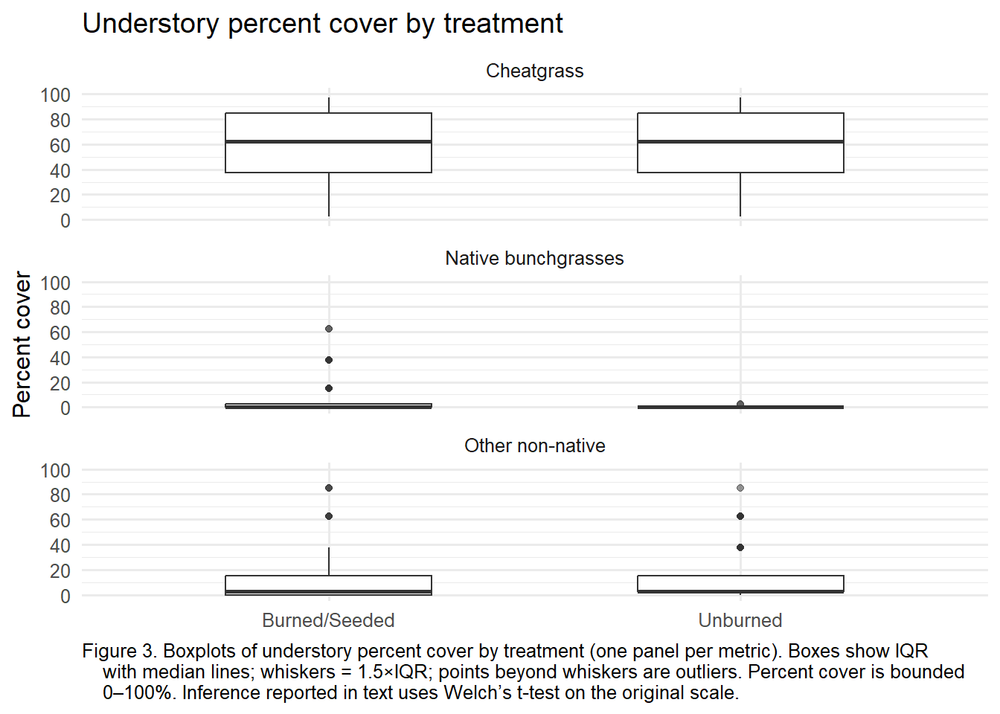

# Fire Ecology and Restoration Analysis (R Quarto Project)

This repository contains an ecological research project exploring fire dynamics and their impacts on ecosystems.  
The analysis and manuscript were created using **R** and **Quarto**.

## Contents
- **fire_ecology.qmd** – Quarto source file with R code, analysis, and narrative.
- **fire_ecology.html** – Rendered version of the paper for easy viewing.
- **data/** – Supporting dataset(s) used in the analysis.
- **figures/** – Exported plots and figures.

## How to Reproduce
1. Install [R](https://cran.r-project.org/) and [Quarto](https://quarto.org/).
2. Open `fire_ecology.qmd` in RStudio or VS Code.
3. Run:
   ```bash
   quarto render fire_ecology.qmd
## Results

Here is an example plot from the analysis:



## Data Sources
- Student-collected field data (Boise State University, Fall 2023).  
- Supplementary climate data from [NOAA](https://www.noaa.gov/).

## License
This project is licensed under the MIT License – see the [LICENSE](LICENSE) file for details.
